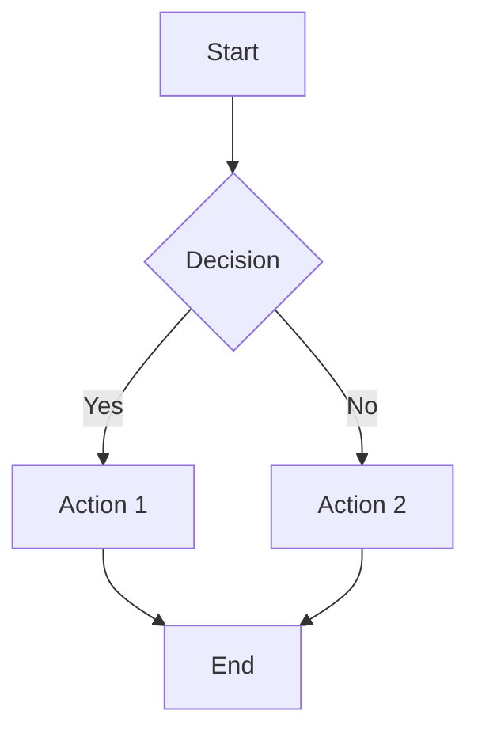

# Markdown Features

Muni supports standard Markdown syntax with additional features for rich documentation.

## Basic Markdown

### Headings

```markdown
# Heading 1

## Heading 2

### Heading 3

#### Heading 4

##### Heading 5

###### Heading 6
```

### Text Formatting

```markdown
**Bold text**
_Italic text_
~~Strikethrough~~
`Inline code`
```

### Lists

```markdown
- Unordered list item 1
- Unordered list item 2
  - Nested item
  - Another nested item

1. Ordered list item 1
2. Ordered list item 2
   1. Nested numbered item
   2. Another nested item
```

### Links and Images

```markdown
[Link text](https://example.com)
[Internal link](/getting-started)


```

### Code Blocks

````markdown
```javascript
function hello() {
  console.log("Hello, world!");
}
```

```python
def hello():
    print("Hello, world!")
```
````

### Blockquotes

```markdown
> This is a blockquote.
>
> It can span multiple lines.
>
> > And can be nested.
```

### Tables

```markdown
| Column 1 | Column 2 | Column 3 |
| -------- | -------- | -------- |
| Row 1    | Data     | More     |
| Row 2    | Data     | More     |
```

## MDX Features

Muni uses MDX, which allows you to use React components in your Markdown.

### React Components

```jsx
<Button>Click me</Button>

<div className="bg-blue-100 p-4 rounded">
  This is a custom styled div.
</div>
```

### Custom Components

You can create custom components for your documentation:

```jsx
// components/InfoBox.jsx
export function InfoBox({ children, type = "info" }) {
  return (
    <div
      className={`p-4 rounded border-l-4 ${
        type === "warning"
          ? "border-yellow-400 bg-yellow-50"
          : type === "error"
          ? "border-red-400 bg-red-50"
          : "border-blue-400 bg-blue-50"
      }`}
    >
      {children}
    </div>
  );
}
```

Then use it in your MDX:

```jsx
<InfoBox type="warning">This is a warning message.</InfoBox>
```

## Frontmatter

Add metadata to your pages using YAML frontmatter:

```yaml
---
title: "Page Title"
description: "Page description for SEO"
author: "Your Name"
date: "2024-01-01"
tags: ["documentation", "guide"]
---
```

### Available Frontmatter Fields

- `title`: Page title (used in navigation)
- `description`: Meta description for SEO
- `author`: Author name (shown in footer)
- `date`: Publication date (shown in footer)
- `tags`: Array of tags for categorization

## Syntax Highlighting

Code blocks are automatically syntax highlighted using Shiki:

````markdown
```javascript
// JavaScript with syntax highlighting
function fibonacci(n) {
  if (n <= 1) return n;
  return fibonacci(n - 1) + fibonacci(n - 2);
}
```

```python
# Python with syntax highlighting
def fibonacci(n):
    if n <= 1:
        return n
    return fibonacci(n - 1) + fibonacci(n - 2)
```
````

### Supported Languages

- JavaScript/TypeScript
- Python
- Java
- C/C++
- Go
- Rust
- HTML/CSS
- JSON
- YAML
- And many more...

## Custom Styling

### Inline Styles

Use Tailwind CSS classes for styling:

```jsx
<div className="bg-gray-100 p-4 rounded-lg">
  <h3 className="text-lg font-semibold text-gray-800">Custom Styled Section</h3>
  <p className="text-gray-600 mt-2">This content has custom styling.</p>
</div>
```

### CSS Classes

You can also use custom CSS classes:

```css
/* styles/custom.css */
.highlight {
  background: linear-gradient(90deg, #f0f9ff, #e0f2fe);
  padding: 1rem;
  border-radius: 0.5rem;
  border-left: 4px solid #0ea5e9;
}
```

```jsx
<div className="highlight">This content uses a custom CSS class.</div>
```

## Advanced Features

### Math Equations

Use KaTeX for mathematical expressions:

```markdown
Inline math: $E = mc^2$

Block math:

$$
\int_{-\infty}^{\infty} e^{-x^2} dx = \sqrt{\pi}
$$
```

### Diagrams

Create diagrams using Mermaid:

````markdown

````

### Callouts

Use custom callout components:

```jsx
<Callout type="info">
  This is an informational callout.
</Callout>

<Callout type="warning">
  This is a warning callout.
</Callout>

<Callout type="error">
  This is an error callout.
</Callout>
```

## Advanced Markdown Features

### Custom Directives

Muni supports custom MDX directives for enhanced functionality:

```markdown
::info{title="Important Note"}
This is an important note using a custom directive.
::

::warning
This is a warning without a title.
::

::tip{title="Pro Tip"}
Use custom directives for better content organization.
::
```

### Code Folding

```markdown
:::details{title="Show Code"}
```typescript
function complexFunction() {
  // Complex implementation here
  return result;
}
```
:::
```

### Inline Components

```jsx
<Callout type="info" title="Live Example">
  This callout is rendered as a React component.
</Callout>
```

<CodeGroup>
  ```typescript title="TypeScript"
  interface User {
    name: string;
    email: string;
  }
  ```
  
  ```javascript title="JavaScript"
  const user = {
    name: "John",
    email: "john@example.com"
  };
  ```
</CodeGroup>

### Advanced Tables

| Feature | Support | Notes |
|---------|---------|-------|
| **Bold headers** | ✅ | Use `**text**` |
| `Code in cells` | ✅ | Use backticks |
| [Links](https://example.com) | ✅ | Standard markdown |
| ~~Strikethrough~~ | ✅ | Use `~~text~~` |
| *Italic* | ✅ | Use `*text*` |

### Mathematical Expressions

Inline math: `$E = mc^2$`

Block math:

```math
\int_{-\infty}^{\infty} e^{-x^2} dx = \sqrt{\pi}
```

### Diagrams with Mermaid


## Best Practices

### Writing Style

1. **Use clear headings**: Structure your content with descriptive headings
2. **Keep paragraphs short**: Break up long text into digestible chunks
3. **Use lists**: Break down complex information into bullet points
4. **Include examples**: Show, don't just tell
5. **Be consistent**: Use consistent formatting throughout
6. **Use active voice**: Write in active voice for clarity
7. **Avoid jargon**: Use simple, clear language
8. **Include context**: Provide background information when needed

### Code Examples

1. **Use syntax highlighting**: Always specify the language for code blocks
2. **Include context**: Explain what the code does
3. **Keep examples simple**: Don't overwhelm readers with complex code
4. **Test your examples**: Make sure code examples actually work
5. **Add comments**: Include helpful comments in code examples
6. **Show output**: Include expected output when relevant
7. **Use realistic data**: Use meaningful variable names and data

### Images

1. **Optimize images**: Use appropriate formats and sizes
2. **Add alt text**: Always include descriptive alt text
3. **Use consistent styling**: Keep image sizes and styles consistent
4. **Consider dark mode**: Ensure images work in all themes
5. **Use captions**: Add captions for complex images
6. **Compress files**: Optimize file sizes for web
7. **Use vector graphics**: Prefer SVG for diagrams and icons

### Links

1. **Use descriptive text**: Don't use "click here" or "read more"
2. **Check your links**: Make sure all links work
3. **Use relative links**: For internal links, use relative paths
4. **Open external links in new tabs**: Use `target="_blank"` for external links
5. **Use meaningful URLs**: Create readable, SEO-friendly URLs
6. **Avoid broken links**: Regularly check and update links
7. **Use anchor links**: Link to specific sections when relevant

### Content Organization

1. **Start with an outline**: Plan your content structure first
2. **Use consistent formatting**: Apply the same style throughout
3. **Group related content**: Use sections and subsections effectively
4. **Include a table of contents**: For long documents
5. **Add cross-references**: Link to related sections
6. **Use callouts effectively**: Highlight important information
7. **End with next steps**: Guide readers to related content

### Accessibility

1. **Use semantic HTML**: Let MDX generate proper HTML structure
2. **Add alt text**: Include descriptive alt text for images
3. **Use proper heading hierarchy**: Don't skip heading levels
4. **Ensure color contrast**: Make sure text is readable
5. **Use descriptive link text**: Avoid generic phrases
6. **Test with screen readers**: Verify accessibility
7. **Include captions**: Add captions for videos and complex images

## Examples

### Complete Page Example

```yaml
---
title: "API Reference"
description: "Complete API documentation for our service"
author: "Development Team"
date: "2024-01-15"
---
```

````markdown
# API Reference

Our API provides a simple interface for managing resources.

## Authentication

All API requests require authentication using an API key:

```javascript
const response = await fetch("/api/users", {
  headers: {
    Authorization: "Bearer your-api-key",
    "Content-Type": "application/json",
  },
});
```
````

## Endpoints

### GET /users

Retrieve a list of users.

**Parameters:**

- `limit` (optional): Number of users to return (default: 10)
- `offset` (optional): Number of users to skip (default: 0)

**Response:**

```json
{
  "users": [
    {
      "id": 1,
      "name": "John Doe",
      "email": "john@example.com"
    }
  ],
  "total": 100
}
```

<InfoBox type="info">
  The API rate limit is 1000 requests per hour per API key.
</InfoBox>
```
